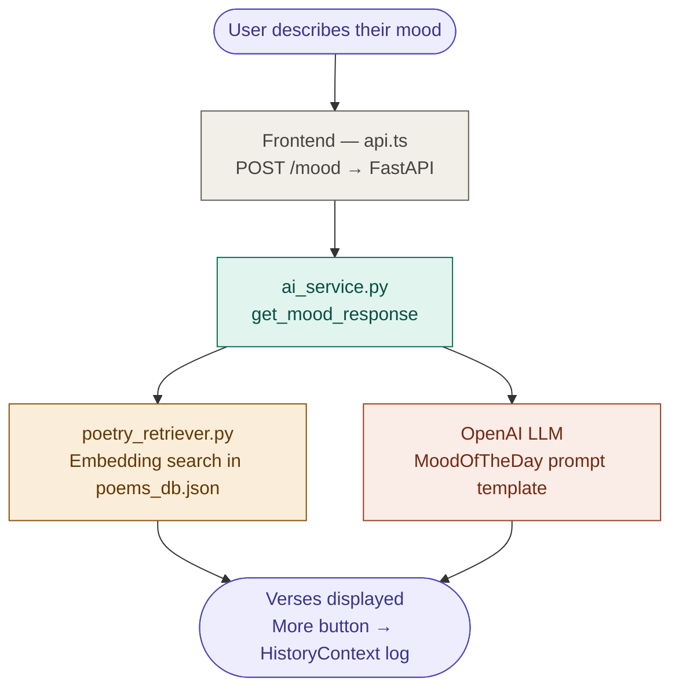
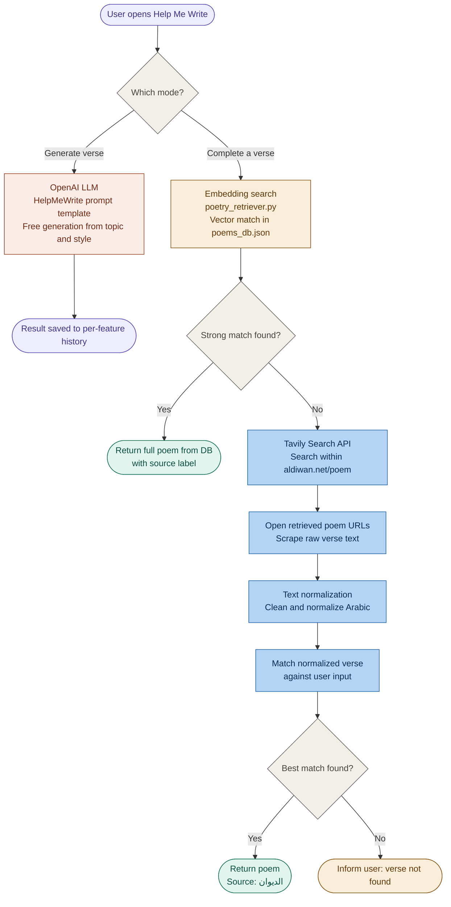
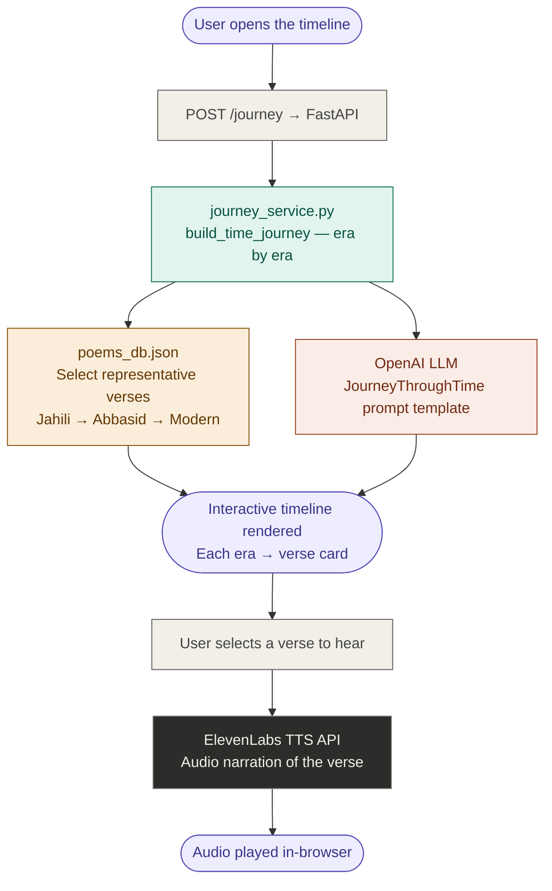
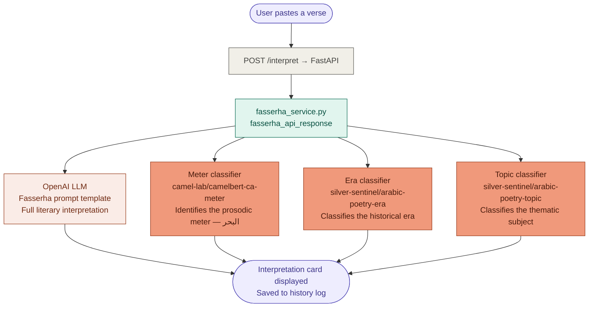
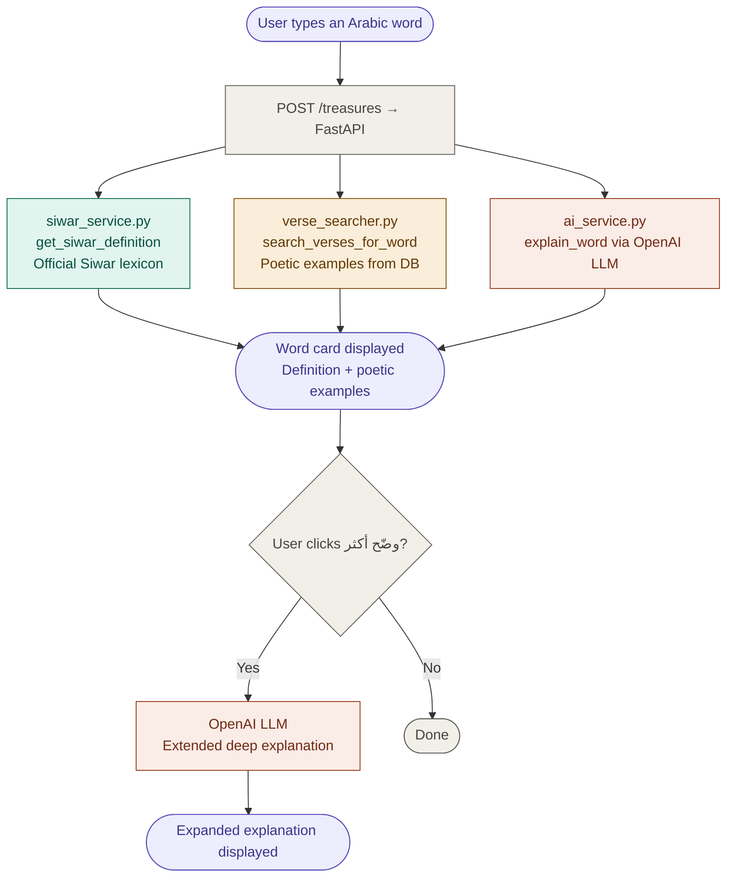
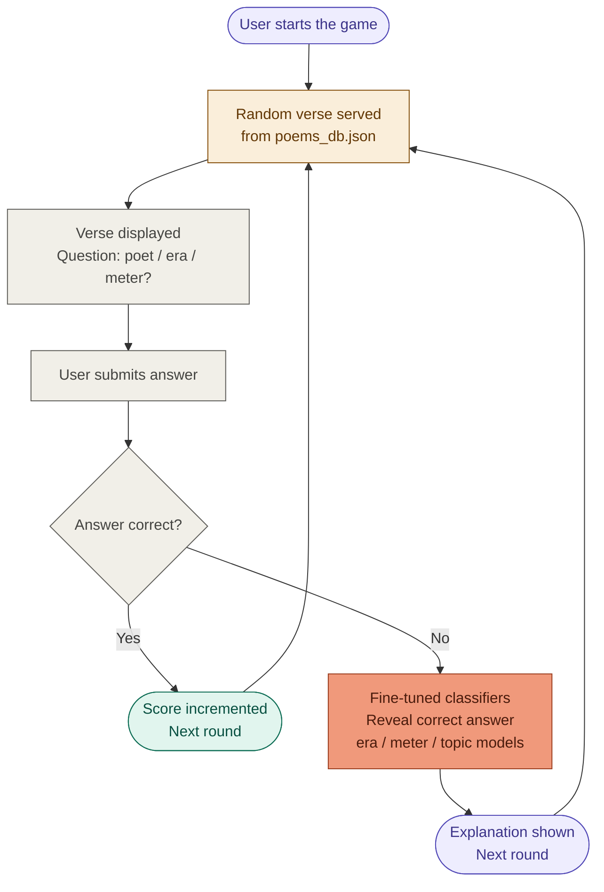

# لَسِن (Lasan) — Arabic Poetry Web Application

> An immersive, AI-powered web experience dedicated to Arabic poetry — exploring classical verses, generating new poetry, interpreting meanings, and journeying through poetic history.

---

## Table of Contents

- [Tech Badges](#tech-badges)
- [Overview](#overview)
- [Features & Diagrams](#features--diagrams)
- [Fine-Tuned Models](#fine-tuned-models)
- [Tech Stack](#tech-stack)
- [Project Structure](#project-structure)
- [Getting Started](#getting-started)
- [Backend Architecture](#backend-architecture)
- [Frontend Architecture](#frontend-architecture)
- [API Reference](#api-reference)
- [Deployment](#deployment)

---

## Tech Badges


---

## Overview

**لَسِن (Lasan)** is a full-stack web application that brings Arabic poetry to life through artificial intelligence. It offers six core experiences — from discovering poems that match your mood, to exploring centuries of Arabic literary history on an interactive timeline, to unlocking the deep meaning behind classical verses through a combination of large language models and custom fine-tuned classifiers.

The frontend is a React/TypeScript SPA styled with Tailwind CSS and shadcn/ui. The backend is a FastAPI (Python) service deployed on Render.com, powered by OpenAI, three domain-specific fine-tuned ML models, embedding-based semantic search, the Siwar Lexicon API, Tavily web search, ElevenLabs TTS, and a curated local poetry database of ~3.4 MB.

---

## Features & Diagrams

Each diagram traces the full request-to-response flow — from the user interaction on the frontend, through the FastAPI routing layer and business logic services, down to the models, external APIs, and data sources.

---

### 1 — Mood of the Day

Chat-based interface: the user describes their current feeling and receives curated Arabic verses matched to that emotion.



---

### 2 — Help Me Write

Two distinct modes with separate pipelines. **Generate** goes directly to an LLM. **Complete** first searches the local embedding DB, then falls back to scraping aldiwan.net via Tavily if no strong match is found.



---

### 3 — Journey Through Time

Interactive timeline of Arabic poetic eras with representative verses per era, enhanced with audio narration powered by ElevenLabs TTS.



---

### 4 — Poetry Interpretation

Verse analysis is split between an LLM (for the full literary interpretation) and three independent fine-tuned ML classifiers — one per classification task. There is no emotional mood detection or semantic similarity analysis in this feature.



---

### 5 — Treasures of Words

Word lookup powered by three parallel sources, with a "Tell me more" option that triggers a deeper LLM explanation.



---

### 6 — Poetry Game

An interactive quiz game where the user is challenged to identify the poet, era, or meter of a displayed verse. Answers are validated using the same fine-tuned classifiers from the interpretation feature.



---

## Fine-Tuned Models

Three domain-specific models were fine-tuned on Arabic poetry corpora and are loaded into memory at backend startup for low-latency inference. Each model handles one classification task independently.

### Meter Classifier — البحر

| Property | Detail |
|---|---|
| Base model | `CAMeL-Lab/camelbert-ca` |
| Fine-tuned model | `camel-lab/camelbert-ca-meter` |
| Task | Multi-class classification of Arabic prosodic meters (Tawil, Kamil, Basit, Wafir, and others) |
| Framework | HuggingFace Transformers + PyTorch |

CAMeL-BERT is a BERT-variant pre-trained exclusively on Classical and Modern Standard Arabic, making it the natural base for prosodic analysis. Fine-tuning on annotated Arabic verse lines trains the model to recognise rhythmic patterns (تفعيلة) and map them to one of the traditional 16 Arabic meters. Classical Arabic pre-training is critical here — generic multilingual models lack the morphological depth to distinguish subtle prosodic differences.

### Era Classifier — العصر

| Property | Detail |
|---|---|
| Base model | `aubmindlab/bert-base-arabertv2` |
| Fine-tuned model | `silver-sentinel/arabic-poetry-era` |
| Task | Multi-class classification across six historical periods (Jahili, Islamic, Abbasid, Andalusian, Mamluk, Modern) |
| Framework | HuggingFace Transformers + PyTorch |

AraBERT v2 was selected because its pre-training corpus spans both classical and contemporary Arabic text, enabling the model to detect the lexical and stylistic markers that shift across eras — from the pre-Islamic desert imagery and tribal lexicon of the Jahili period, to the urban metaphors and philosophical language of the Abbasid age, to the direct colloquial-influenced diction of modern verse.

### Topic Classifier — الموضوع

| Property | Detail |
|---|---|
| Base model | `aubmindlab/bert-base-arabertv2` |
| Fine-tuned model | `silver-sentinel/arabic-poetry-topic` |
| Task | Multi-class classification across eight thematic categories (elegy, praise, romance, asceticism, description, satire, wisdom, nature) |
| Framework | HuggingFace Transformers + PyTorch |

The same AraBERT v2 base is reused for topic classification. Shared pre-training weights allow both the era and topic models to be loaded memory-efficiently in the same process, while their independent fine-tuning heads keep task-specific accuracy high. Topic classification enables features like mood-based verse retrieval and the poetry game's thematic challenge mode.

---

## Tech Stack

### Frontend
- **React 18** + **TypeScript**
- **Vite** — development server and bundler
- **Tailwind CSS** — utility-first styling
- **shadcn/ui** — 49 pre-built, customizable UI components
- **React Router** — client-side routing
- **React Query** — server state management
- **Framer Motion** — animations (floating Arabic letters background, transitions)
- **Recharts** — data visualization
- **Sonner** — toast notifications
- **React Hook Form** — form management

### Backend
- **FastAPI** — REST API framework
- **Uvicorn** — ASGI server (`uvicorn main:app --port 8000`)
- **OpenAI API** — LLM for verse generation, mood responses, interpretation, and word explanation
- **HuggingFace Transformers + PyTorch** — fine-tuned Arabic poetry classifiers (meter, era, topic)
- **Sentence-Transformers** — pre-computed embedding vectors for semantic verse search
- **Tavily Search API** — web search fallback that scrapes `aldiwan.net` for verse completion
- **ElevenLabs API** — TTS audio narration for Journey Through Time
- **Siwar API** — Arabic lexicon for authoritative word definitions
- **Supabase** — supplementary data storage
- **Pydantic** — request/response validation

---

## Project Structure

```
root/
├── Backend/
│   ├── main.py                      # FastAPI entry point — all endpoints + CORS
│   ├── schemas.py                   # Pydantic request/response models
│   ├── poems_db.json                # Poetry database (~3.4 MB, loaded at startup)
│   ├── Requirements.txt             # Full Python dependency list
│   ├── runtime.txt                  # Pins Python 3.11.9 for Render
│   │
│   ├── Embeddings/                  # Pre-computed verse embedding vectors
│   │   └── verse_embeddings.npy     # NumPy array — sentence-transformers output
│   │
│   ├── Models/                      # Fine-tuned HuggingFace model weights
│   │   ├── meter_model/             # camelbert-ca-meter (البحر classifier)
│   │   ├── era_model/               # arabic-poetry-era (العصر classifier)
│   │   └── topic_model/             # arabic-poetry-topic (الموضوع classifier)
│   │
│   ├── Prompts/                     # LLM prompt templates (per feature)
│   │   ├── MoodOfTheDay_promts.py
│   │   ├── Fasserha_prompts.py
│   │   ├── HelpMeWrite_prompts.py
│   │   ├── JourneyThroughTime_prompts.py
│   │   └── TreasuresOfWords_promts.py
│   │
│   └── services/                    # Business logic — one file per feature
│       ├── ai_service.py            # OpenAI wrapper (explain_word, get_mood_response)
│       ├── fasserha_service.py      # Verse interpretation — LLM + 3 classifiers
│       ├── help_me_write_service.py # Generation (LLM) + completion (embedding + Tavily)
│       ├── journey_service.py       # Timeline builder + ElevenLabs TTS
│       ├── poetry_retriever.py      # Embedding search over poems_db.json
│       ├── siwar_service.py         # Siwar lexicon API client
│       ├── supabase_client.py       # Supabase connection
│       └── verse_searcher.py        # Keyword search for Treasures of Words
│
├── public/                          # Static assets served as-is
│   ├── bg-texture.png
│   ├── favicon.ico
│   ├── placeholder.svg
│   └── robots.txt
│
└── src/                             # React application source
    ├── components/
    │   ├── ui/                      # 49 shadcn/ui components
    │   ├── AppSidebar.tsx
    │   ├── ArabicLettersBg.tsx
    │   ├── NavLink.tsx
    │   ├── OrnamentalDivider.tsx
    │   ├── PageLayout.tsx
    │   └── PageNavButton.tsx
    ├── contexts/
    │   └── HistoryContext.tsx        # Cross-page interaction history
    ├── pages/
    │   ├── Index.tsx
    │   ├── MoodOfTheDay.tsx
    │   ├── HelpMeWrite.tsx
    │   ├── JourneyThroughTime.tsx
    │   ├── PoetryInterpretation.tsx
    │   ├── TreasuresOfWords.tsx
    │   ├── PoetryGame.tsx
    │   └── NotFound.tsx
    ├── services/
    │   └── api.ts                   # Fetch wrapper for all backend calls
    ├── App.tsx                      # React Router + QueryClient + Providers
    ├── index.css                    # Design system: HSL tokens, Arabic fonts, gradients
    └── main.tsx                     # Entry point — ReactDOM.render(<App />)
```

---

## Getting Started

### Prerequisites

- Node.js ≥ 18
- Python 3.11.9

### Frontend

```bash
npm install
npm run dev       # development server
npm run build     # production build
npm run test      # run Vitest tests
```

### Backend

```bash
cd Backend
python -m venv venv
source venv/bin/activate      # macOS/Linux
venv\Scripts\activate         # Windows
pip install -r Requirements.txt
uvicorn main:app --reload --port 8000
```

---

## Backend Architecture

```
Frontend (api.ts)
      │  HTTP/JSON
      ▼
FastAPI (main.py)              ← all endpoints + CORS routing
      │
      ├── schemas.py            ← Pydantic validation
      │
      └── services/             ← business logic per feature
            │
            ├── OpenAI API                (LLM — generation, interpretation, mood, words)
            ├── HuggingFace Models        (meter / era / topic fine-tuned classifiers)
            ├── Sentence-Transformers     (embedding search over poems_db.json)
            ├── Tavily Search API         (web fallback → scrape aldiwan.net)
            ├── ElevenLabs API            (TTS narration for Journey Through Time)
            ├── Siwar API                 (Arabic lexicon definitions)
            └── Supabase                  (supplementary storage)
                      ▲
                Prompts/*.py              (LLM prompt templates per feature)
```

**Key decisions:**

- `poems_db.json` is loaded into memory at startup for zero-latency lookups — no DB round-trip on every request.
- Verse embeddings are pre-computed offline and stored in `Embeddings/verse_embeddings.npy`. At startup they are loaded alongside the DB so that semantic search is a cosine similarity operation with no re-encoding overhead at inference time.
- The three fine-tuned classifiers are loaded once at startup and kept resident in memory. Sharing an AraBERT base between the era and topic models reduces cold-start memory overhead while independent fine-tuning heads preserve per-task accuracy.
- Verse completion uses a two-stage fallback: local embedding search first (fast, offline), then Tavily + aldiwan.net scraping + Arabic text normalization if the local match score falls below the confidence threshold.

---

## Frontend Architecture

A React 18 SPA with six main routes, all sharing a `PageLayout` wrapper (sidebar + header + content area). Global state is managed through `HistoryContext` for cross-page interaction logs and React Query for server-side caching. The design system in `index.css` defines HSL color tokens (gold, parchment, warm brown), loads Arabic web fonts (Aref Ruqaa, Amiri, Cairo), and drives the floating-letter background animation via custom Tailwind keyframes.

---

## API Reference

> **What is `POST`?** Every feature call uses `POST` — the HTTP method for sending data to the server. The frontend packages the user's input as a JSON body, the backend reads it, runs the full pipeline, and returns a structured JSON response.

| Endpoint | Method | Feature |
|---|---|---|
| `/mood` | POST | Mood of the Day — embedding search + LLM response |
| `/write` | POST | Help Me Write — LLM generation or embedding + Tavily completion |
| `/journey` | POST | Journey Through Time — era timeline + ElevenLabs TTS |
| `/interpret` | POST | Poetry Interpretation — LLM + 3 fine-tuned classifiers |
| `/treasures` | POST | Treasures of Words — Siwar + DB search + LLM explanation |

---

## Deployment

| Layer | Platform |
|---|---|
| Frontend | Lovable / Vercel / Netlify |
| Backend | Render.com (Python 3.11.9) |
| Models | Loaded from `Backend/Models/` at startup |
| Embeddings | Loaded from `Backend/Embeddings/` at startup |
| Database | `poems_db.json` in-memory + Supabase |

The `venv/` directory and `Embeddings/*.npy` binary files should be added to `.gitignore` and not committed to the repository.

---

## Design Philosophy

لَسِن is designed to feel like a digital manuscript. The UI draws on classical Arabic aesthetics — parchment textures, calligraphic letter animations, gold ornamental dividers, and Islamic geometric motifs — rendered with modern web technology to deliver a seamless, emotionally resonant experience.

---

## License

This project is proprietary. All rights reserved.
