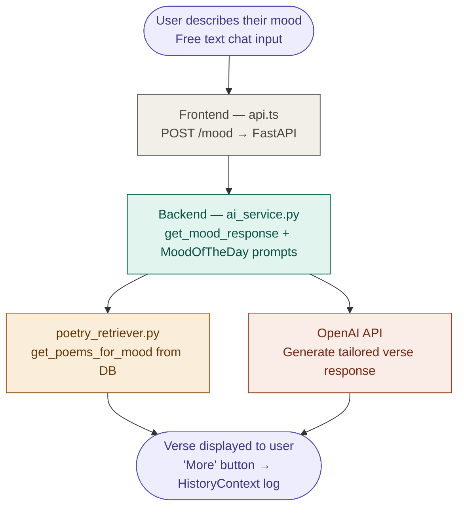
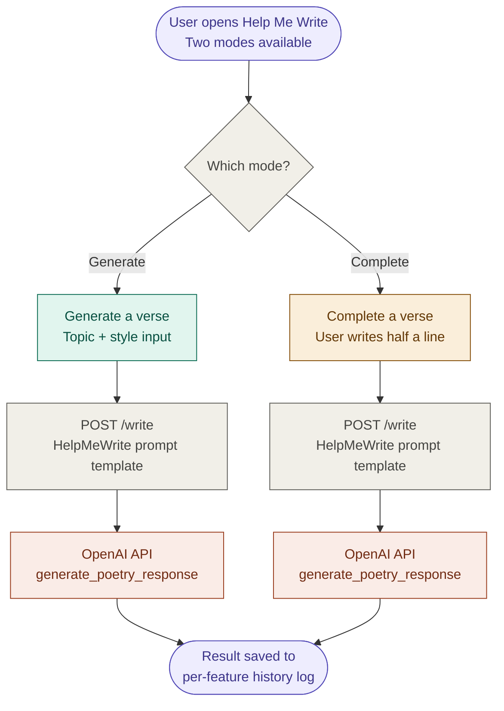
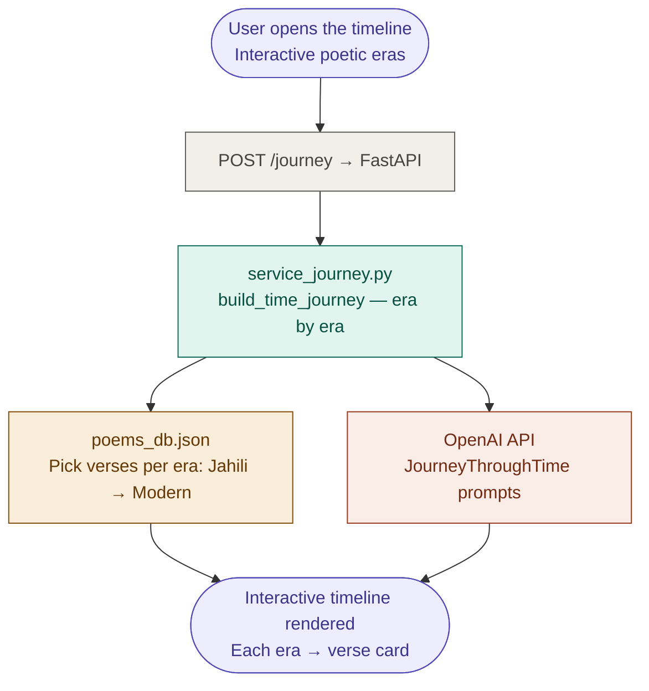
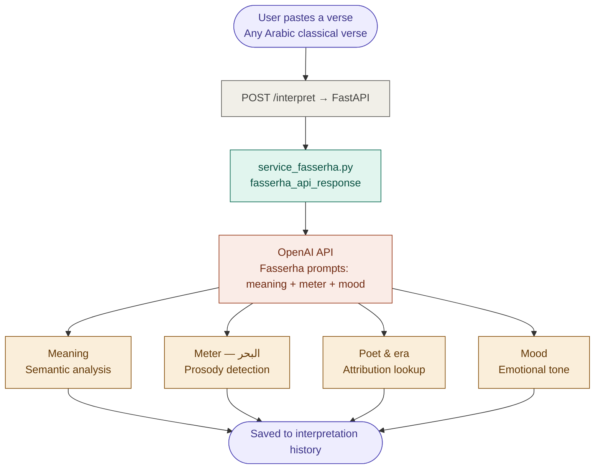
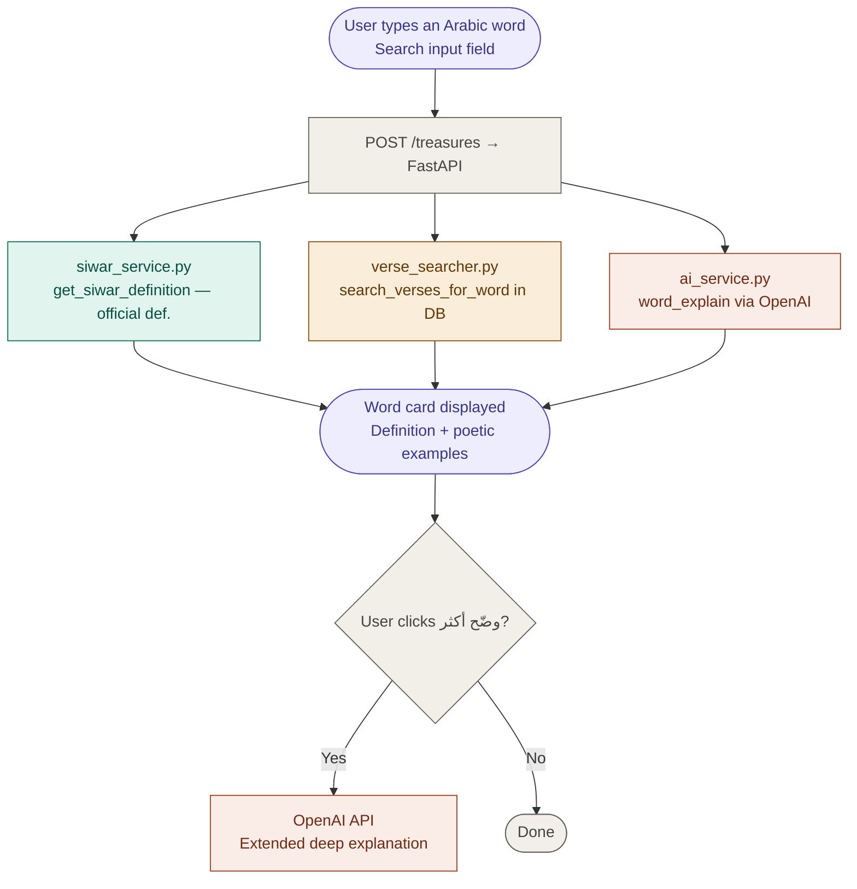

# لَسِن (Lasan) — Arabic Poetry Web Application

> An immersive, AI-powered web experience dedicated to Arabic poetry — exploring classical verses, generating new poetry, interpreting meanings, and journeying through poetic history.

---

## Table of Contents

- [Overview](#overview)
- [Features](#features)
- [Tech Stack](#tech-stack)
- [Project Structure](#project-structure)
- [Getting Started](#getting-started)
- [Backend Architecture](#backend-architecture)
- [Frontend Architecture](#frontend-architecture)
- [Feature Diagrams](#feature-diagrams)
- [API Reference](#api-reference)
- [Environment Variables](#environment-variables)
- [Deployment](#deployment)

---

## Overview

**لَسِن (Lasan)** is a full-stack web application that brings Arabic poetry to life through artificial intelligence. It offers five core experiences — from discovering poems that match your mood, to exploring centuries of Arabic literary history on an interactive timeline, to unlocking the deep meaning behind classical verses.

The frontend is a React/TypeScript SPA styled with Tailwind CSS and shadcn/ui, while the backend is a FastAPI (Python) service deployed on Render.com, powered by OpenAI, the Siwar Lexicon API, and a curated local poetry database.

---

## Features

| Page | Description |
|---|---|
| **Home** | Landing page with the Lasan brand, a roadmap visual, and an opening verse |
| **Mood of the Day** | Chat-based interface — describe your feeling, receive curated verses |
| **Help Me Write** | AI poetry generator and verse-completion tool, with per-feature history |
| **Journey Through Time** | Interactive timeline of Arabic poetic eras with representative verses |
| **Poetry Interpretation** | Central mind-map for deep analysis of any verse (meaning, meter, atmosphere) |
| **Treasures of Words** | Word lookup with poetic examples drawn from the database, with a "Tell me more" option |

---

## Tech Stack

### Frontend
- **React 18** + **TypeScript**
- **Vite** — development server and bundler
- **Tailwind CSS** — utility-first styling
- **shadcn/ui** — 49 pre-built, customizable UI components
- **React Router** — client-side routing
- **React Query** — server state management
- **Framer Motion** — animations (floating Arabic letters background, transitions)
- **Recharts** — data visualization
- **Sonner** — toast notifications
- **React Hook Form** — form management

### Backend
- **FastAPI** — REST API framework
- **Uvicorn** — ASGI server (`uvicorn main:app --port 8000`)
- **OpenAI API** — AI-powered verse generation, mood responses, and word explanation
- **Siwar API** — Arabic lexicon for authoritative word definitions
- **Supabase** — supplementary data storage
- **PyTorch + Transformers** — optional semantic embeddings for poetry retrieval
- **Pydantic** — request/response validation
- **Hugging Face Hub** — model hosting

---

## Project Structure

```
root/
├── Backend/                    # Python FastAPI backend
│   ├── main.py                 # Entry point — all API endpoints, CORS config
│   ├── schemas.py              # Pydantic request/response models
│   ├── poems_db.json           # Main poetry database (~3.4 MB, loaded at startup)
│   ├── Requirements.txt        # Full Python dependency list
│   ├── runtime.txt             # Python version for Render (3.11.9)
│   ├── Prompts/                # AI prompt templates (per feature)
│   │   ├── MoodOfTheDay_promts.py
│   │   ├── Fasserha_prompts.py
│   │   ├── HelpMeWrite_prompts.py
│   │   ├── JourneyThroughTime_prompts.py
│   │   └── TreasuresOfWords_promts.py
│   └── services/               # Business logic layer
│       ├── ai_service.py       # OpenAI wrapper (word explain, mood response)
│       ├── service_fasserha.py # Verse interpretation service
│       ├── help_me_write_service.py
│       ├── service_journey.py  # Timeline builder
│       ├── poetry_retriever.py # Search engine over poems_db.json
│       ├── siwar_service.py    # Siwar API client
│       ├── supabase_client.py  # Supabase connection
│       └── verse_searcher.py   # Word-in-verse search (used by Treasures of Words)
│
├── public/                     # Static assets (served as-is)
│   ├── texture-bg.png
│   ├── favicon.ico
│   ├── placeholder.svg
│   └── robots.txt
│
└── src/                        # React application source
    ├── assets/                 # Bundled assets (imported as ES modules)
    ├── components/
    │   ├── ui/                 # 49 shadcn/ui components
    │   ├── AppSidebar.tsx      # Right sidebar — logo + 5-page navigation
    │   ├── ArabicLettersBg.tsx # Animated floating Arabic letters background
    │   ├── NavLink.tsx         # Custom navigation link component
    │   ├── OrnamentalDivider.tsx # Arabic ornamental divider (gold + Islamic motifs)
    │   ├── PageLayout.tsx      # Shared layout (Sidebar + Header + Content)
    │   └── PageNavButton.tsx   # Sequential page navigation button
    ├── contexts/
    │   └── HistoryContext.tsx  # Global context for cross-page interaction history
    ├── hooks/
    │   ├── use-mobile.tsx      # Mobile detection (< 768px)
    │   └── use-toast.ts        # Toast notification hook
    ├── lib/
    │   └── utils.ts            # `cn()` utility (clsx + tailwind-merge)
    ├── pages/
    │   ├── Index.tsx
    │   ├── MoodOfTheDay.tsx
    │   ├── HelpMeWrite.tsx
    │   ├── JourneyThroughTime.tsx
    │   ├── PoetryInterpretation.tsx
    │   ├── TreasuresOfWords.tsx
    │   └── NotFound.tsx
    ├── services/
    │   └── api.ts              # Backend API calls (fetch wrapper for Render.com)
    ├── App.tsx                 # Root — React Router + QueryClient + Providers
    ├── index.css               # Design system: CSS variables, HSL colors, Arabic fonts, gradients
    └── main.tsx                # Entry point — ReactDOM.render(<App />)
```

---

## Getting Started

### Prerequisites

- Node.js ≥ 18
- Python 3.11.9
- An OpenAI API key
- (Optional) Siwar API key, Supabase project credentials

### Frontend

```bash
# Install dependencies
npm install

# Start development server
npm run dev

# Build for production
npm run build

# Run tests
npm run test
```

### Backend

```bash
cd Backend

# Create and activate virtual environment
python -m venv venv
source venv/bin/activate      # macOS/Linux
venv\Scripts\activate         # Windows

# Install dependencies
pip install -r Requirements.txt

# Start the server
uvicorn main:app --reload --port 8000
```

---

## Backend Architecture

The backend follows a clean layered architecture:

```
Frontend (api.ts)
      │  HTTP/JSON
      ▼
FastAPI (main.py)       ← All endpoints + CORS
      │
      ├── schemas.py    ← Pydantic validation
      │
      └── services/     ← Business logic
            │
            ├── OpenAI API    (AI generation)
            ├── Siwar API     (Arabic lexicon)
            ├── Supabase      (storage)
            └── poems_db.json (local database)
                  ▲
            Uses Prompts/*.py
```

**Key design decisions:**

- The poetry database (`poems_db.json`) is loaded into memory at server startup for fast lookup without a database round-trip.
- Each feature has its own dedicated service file and prompt template, making them independently maintainable.
- Embeddings (via PyTorch/Transformers) are optionally used in `poetry_retriever.py` for semantic mood-based search.

---

## Frontend Architecture

The frontend is a single-page application with React Router managing five main routes. All pages share a unified `PageLayout` (sidebar + header + content area).

**Global state** is handled by two mechanisms:
- `HistoryContext` — stores cross-page interaction history (generation logs, past interpretations, etc.)
- React Query — manages server state and caching for API responses

**Design system** (`index.css`):
- CSS custom properties for the color palette (gold, warm browns, parchment tones)
- Arabic web fonts: Aref Ruqaa, Amiri, Cairo
- HSL-based theming for dark/light adaptability
- Custom Tailwind animations for the floating-letters background

---

## Feature Diagrams

Each diagram shows the full request-to-response flow for one feature — from user interaction on the frontend, through the FastAPI layer and business logic services, down to the external APIs and data sources.

---

### 1 — Mood of the Day



---

### 2 — Help Me Write



---

### 3 — Journey Through Time



---

### 4 — Poetry Interpretation



---

### 5 — Treasures of Words



---

## API Reference

All backend endpoints are consumed through `src/services/api.ts`. The base URL is configured per environment (see Environment Variables).

| Endpoint | Method | Feature |
|---|---|---|
| `/mood` | POST | Mood of the Day — verse suggestions by emotion |
| `/interpret` | POST | Poetry Interpretation — verse analysis |
| `/write` | POST | Help Me Write — generation + completion |
| `/journey` | POST | Journey Through Time — era timeline builder |
| `/treasures` | POST | Treasures of Words — word explanation + examples |

---

## Environment Variables

### Frontend (`src/.env.production`)

```env
VITE_API_BASE_URL=https://your-backend.onrender.com
```

### Backend

```env
OPENAI_API_KEY=sk-...
SIWAR_API_KEY=...
SUPABASE_URL=https://your-project.supabase.co
SUPABASE_KEY=...
```

---

## Deployment

| Layer | Platform |
|---|---|
| Frontend | Lovable / Vercel / Netlify |
| Backend | Render.com (Python 3.11.9, free tier compatible) |
| Database | poems_db.json (in-memory) + Supabase (optional) |

The `runtime.txt` file in `Backend/` pins the Python version for Render's build system. The `venv/` directory should never be committed to Git.

---

## Design Philosophy

لَسِن is designed to feel like an artifact — a digital manuscript. The UI draws on classical Arabic aesthetics: parchment textures, calligraphic letter animations, gold ornamental dividers, and Islamic geometric motifs, all rendered with modern web technology to deliver a seamless, emotionally resonant experience.

---

## License

This project is proprietary. All rights reserved.
